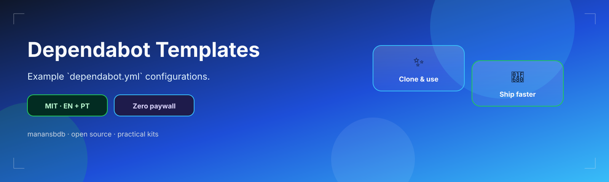
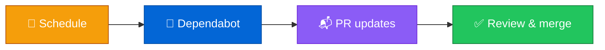

<p align="center">
  
</p>

<h1 align="center">dependabot-templates</h1>

<p align="center">
  <strong>EN</strong> Example dependabot.yml for npm, Actions & more<br/>
  <strong>PT</strong> Exemplos dependabot.yml para npm, Actions e mais
</p>

<p align="center">
  <a href="https://github.com/manansbdb/dependabot-templates/blob/main/LICENSE"></a>
  
  
  <a href="#support--apoio"></a>
</p>

---

## What it does / Para que serve

| English | Português |
|---------|-----------|
| Ready **Dependabot** YAML examples (npm + Actions, multi-ecosystem). | Exemplos YAML **Dependabot** prontos (npm + Actions, multi-ecossistema). |
| Copy into `.github/dependabot.yml` and adjust directories/schedules. | Copia para `.github/dependabot.yml` e ajusta diretórios/schedules. |



---

## Install / Instalação

### 1) Clone / Clona

```bash
git clone https://github.com/manansbdb/dependabot-templates.git
cd dependabot-templates
```

### 2) Apply / Aplica

```bash
mkdir -p /path/to/your-project/.github
# pick one:
cp examples/npm-and-actions.yml /path/to/your-project/.github/dependabot.yml
# or:
cp examples/multi-ecosystem.yml /path/to/your-project/.github/dependabot.yml
cp notes.md /path/to/your-project/docs/dependabot-notes.md
```

### Requirements / Requisitos

- `git`
- GitHub repository with Dependabot enabled

---

## Quick start / Início rápido

```bash
git clone https://github.com/manansbdb/dependabot-templates.git
mkdir -p .github
cp dependabot-templates/examples/npm-and-actions.yml .github/dependabot.yml
```

---

## Contents / Conteúdos

| Path | Purpose / Função |
|------|------------------|
| `examples/npm-and-actions.yml` | npm + Actions |
| `examples/multi-ecosystem.yml` | Multi ecosystem |
| `notes.md` | Tuning tips |
| `SUPPORT.md` | Donations / Doações |

---

## Project layout / Estrutura

```text
dependabot-templates/
├── docs/banner.svg
├── examples/npm-and-actions.yml
├── examples/multi-ecosystem.yml
├── notes.md
├── SUPPORT.md
└── README.md
```

---

## Support / Apoio

Bitcoin donations welcome / Doações em Bitcoin bem-vindas:

```
bc1q0qfnlnxyum9u45stzxe0a7jnhtj4j0usfkqdjw
```

See [SUPPORT.md](./SUPPORT.md).

---

## License / Licença

[MIT](./LICENSE) © 2026 manansbdb
